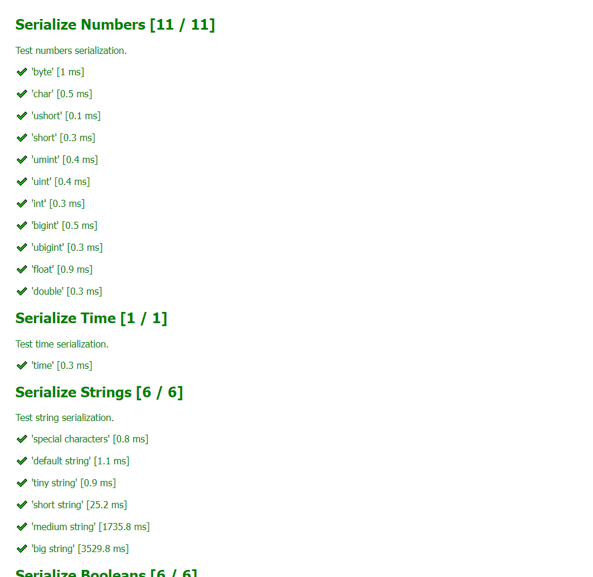
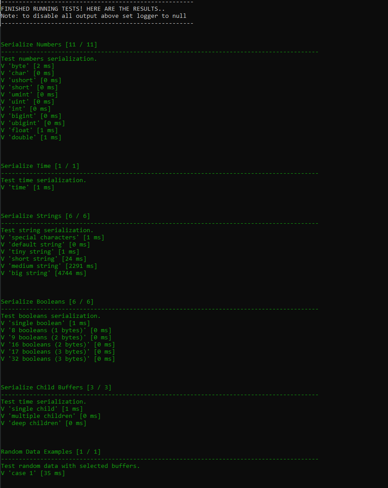
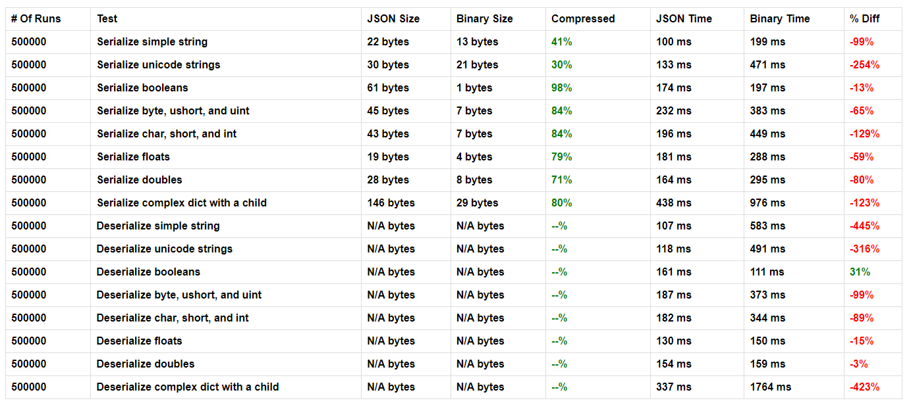
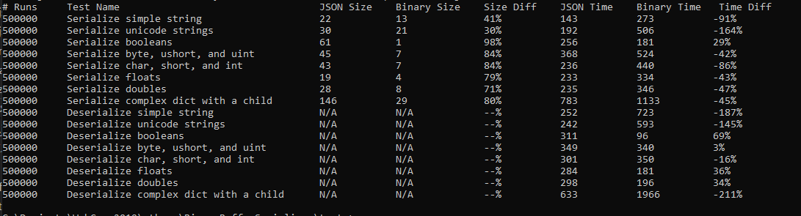

# About

*BinaryBufferSerializer* is a declarative binary serializer for NodeJS and browsers.

**Advantages**:

- Very powerful compression.
- Handle non-standard types like BigInt, Date, enum field and more.
- Can handle partial data.
- Works on both NodeJS and Browsers.
- Easy to setup and use.

**caveats**:

- In many cases slower to process than JSON (especially on chrome).
- Compression is not better than JSON when it comes to string values (but it does reduce the keys part which is something..)

Before we continue, lets see a usage example to give a little taste of this lib:

```js
// define a serializer
let bs = new BinaryBufferSerializer.BinaryBufferSerializer()
    .string("string_field")
    .boolean("some_bool")
    .child("child", 
        new BinaryBufferSerializer.BinaryBufferSerializer()
            .int("child_int")
            .boolean("child_bool")
    );

// serialize data
let binary = bs.serialize({
    string_field: "hello world!",
    some_bool: true,
    child: {
        child_int: 15,
        child_bool: false
    }
});

// later, to deserialize the data..
let data = bs.deserialize(binary);
```


# Installation

## Browser

For browsers, include the built file (either full or minified) found in the `dist` folder.

## Node

For NodeJS, install via NPM:

```npm install binary-buffer-serializer```


# Usage

To use the *BinaryBufferSerializer* you first need to define your schema, then use `serialize` or `deserialize` to dump and parse data.

The compressed data format is a `Buffer` object, with a polyfill version in browsers.

## Serialize Data

To serialize data into a buffer:

```js
let bs = new BinaryBufferSerializer.BinaryBufferSerializer();
// define fields...

let binary = bs.serialize(data);
```

Later, to deserialize a buffer back into data dictionary:

```js
let data = bs.deserialize(binary);
```

## Defining The Schema

To define your data schema, the main `BinaryBufferSerializer` object comes with a set of methods to define schema fields, each comes with optional options to fine-tune the field, and return `this` to allow you to chain fields one after another.

For example, lets define a serializer with an integer and string fields:

```js
let bs = new BinaryBufferSerializer.BinaryBufferSerializer()
                                    .int("field_name")
                                    .string("my_string");
```

### enum(name, options)

Define an enum field (string value that must match one of the provided options). These values are stored as a single byte (enum options can have up to 255 values).

- `options` is an array with valid enum values.

Usage example:

```js
bs.enum("my_enum", ["first", "second", "other"]);
```

### byte(name) / char(name)

Define a single byte numeric field. `byte` is unsigned, `char` is signed.

Usage example:

```js
bs.byte("byte_field");
```

### ushort(name) / short(name)

Define a short field (takes 2 bytes). `ushort` is unsigned, `short` is signed.

Usage example:

```js
bs.short("short_field");
```

### umint(name)

Define an unsigned medium int field (takes 3 bytes).

Usage example:

```js
bs.umint("short_field");
```

### uint(name) / int(name)

Define an int field (takes 4 bytes). `uint` is unsigned, `int` is signed.

Usage example:

```js
bs.int("int_field");
```

### ubigint(name) / bigint(name)

Define a big int field (takes 8 bytes). `ubigint` is unsigned, `bigint` is signed.

Usage example:

```js
bs.bigint("bit_int_field");
```

### float(name)

Define a loose float field that only keeps 3 digits after decimal point (takes 4 bytes).

Usage example:

```js
bs.float("loose_float");
```

### double(name)

Define a precise double field (takes 8 bytes).

Usage example:

```js
bs.double("accurate_double");
```

### boolean(name)

Define a boolean field. All booleans are packed together, with every boolean using a single bit.

Usage example:

```js
bs.boolean("my_bool_flag");
```

### string(name, lenBytes, encodeUtf8)

Define a string field. 

- `lenBytes` is how many bytes to use to store the string length (if not set will use one byte, meaning max string length is 255). 
- `encodeUtf8` if true, will encode string as utf8, meaning it will be able to support non-ascii strings (but slightly slower to serialize).

Usage example:

```js
bs.string("simple_string");
bs.string("long_utf_string", 4, true);
```

### time(name)

Define a Date field, stored as epoch time (using `getTime()`).

Usage example:

```js
bs.time("date_field");
```

### child(name, bs)

Define a child binary buffer field.

Usage example:

```js
// an child field:
bs.child('sub_data',
        new BinaryBufferSerializer.BinaryBufferSerializer() // add some fields..
);
```

### array(arrayLenBytes)

Turn the last defined field into an array. 

- `arrayLenBytes` is how many bytes to use to store the array length (if not set will use one byte, meaning max array length is 255).

Usage example:

```js
// an integers array field:
bs.int('int_array').array();
```

## Extras

### Partial Data

By default, you would need to provide data for every field you define while serializing, or else an exception will be thrown. If you want to be able to serialize / deserialize partial data, you can set the binary buffer serializer like this:

```js
bs.allowPartial(true);
```

Or change the default value before you create new serializers:

```js
BinaryBufferSerializer.defaults.allowPartial = true;
```

### preSerialize

For every field you define you can attach a pre-serialization processing method. 

For example, the following will make sure all the int values are absolute, before they are getting serialized into a buffer:

```js
bs.int('my_abs_val').preSerialize(Math.abs);
```

### postDeserialize

For every field you define you can attach a post-deserialization processing method. 

For example, the following will make sure all the int values are absolute, after they are deserialized from buffer:

```js
bs.int('my_abs_val').postDeserialize(Math.abs);
```


# Build

To build for browser, run `build.bat` on windows, or the following command from shell:

```
browserify lib/index.js --s BinaryBufferSerializer --outfile dist/binary-buffer-serializer.js & uglifyjs --keep-fnames -o dist/binary-buffer-serializer.min.js dist/binary-buffer-serializer.js
```

Building this package requires `browserify` and `uglifyjs`.


# Tests

*BinaryBufferSerializer* have unit tests and performance tests that can run in browser or nodejs.

## Unit Tests

### Browser

To run tests in browser, simply open file `tests/tests.html` with any browser. 

Running the tests should look something like this:



### Node

To run tests in NodeJS, enter folder `tests` and run `node tests.js` from shell. You must be inside the `tests` folder for it to work. 

Running the tests should look something like this:




## Performance Tests

### Browser

To run performance tests in browser, simply open file `tests/performance.html` with any browser. 

Running the tests should look something like this:



### Node

To run performance tests in NodeJS, enter folder `tests` and run `node performance.js` from shell. You must be inside the `tests` folder for it to work. 

Running the tests should look something like this:




# License

This package is released under the permissive MIT license.